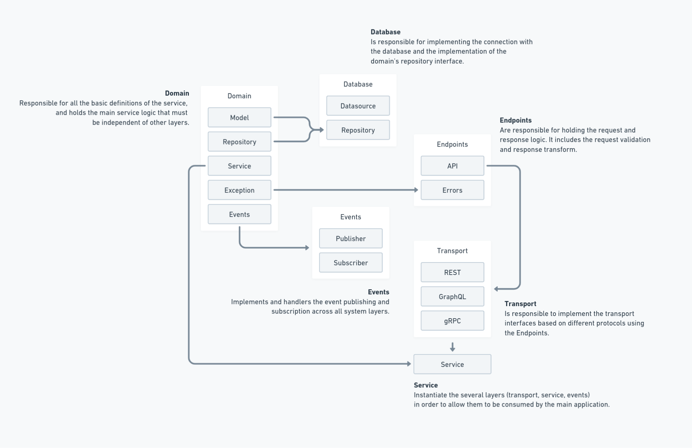

# Folder Layout

```sh
.
├── cmd # Holds the application main file. Every application must have its own folder.
│   └── server # This is the standard server/api application, all microservices must follow this name convention.
│       └── main.go
├── config # Holds all the configuration files needed for the application.
│   └── config.yml
├── db # Holds all database scripts. These files are not delivered with the application.
│   └── migrations # Contains the migrations scripts (SQL scripts) to up and drop the tables.
├── docker-compose.yml
├── Dockerfile
├── internal # This is where the application service layer lives one. Every service must have it's own folder.
│   ├── <service_name> # The service folder. It must be independent from other services.
│   │   ├── database # Holds the database layer and the implementation of the repository's domain.
│   │   ├── domain  # Holds the domain models, and interfaces, as well the domain service that holds the business logic.
│   │   ├── endpoints # The request and response layer. This package handles the transfer logic to be handled by the transport layer.
│   │   ├── service.go # This is where the transport and the service domains are initialized.
│   │   └── transport # Holds the transport layers implementations that uses the endpoints (Rest, gRPC, graphQL, WS)
│   └── swagger.go # Document definition for swagger generator.
├── LICENSE
├── Makefile
├── pkg # Anything that needs to be exposed somehow to be used outside this service.
├── README.md
├── tests # Holds all tests helpers, mocks, and initializations.
│   ├── database
│   │   └── mock.go
│   ├── testing.go
│   └── utils.go
└── vendor # Just the vendoring files. Do not touch it.
```

## Service Layout

This represents the `internal/<service_name>` structure.


